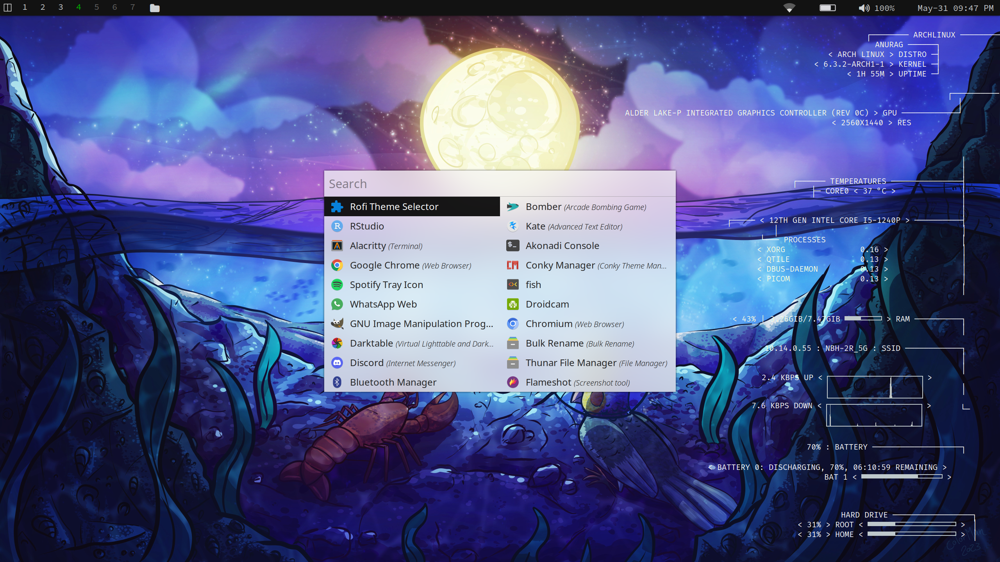
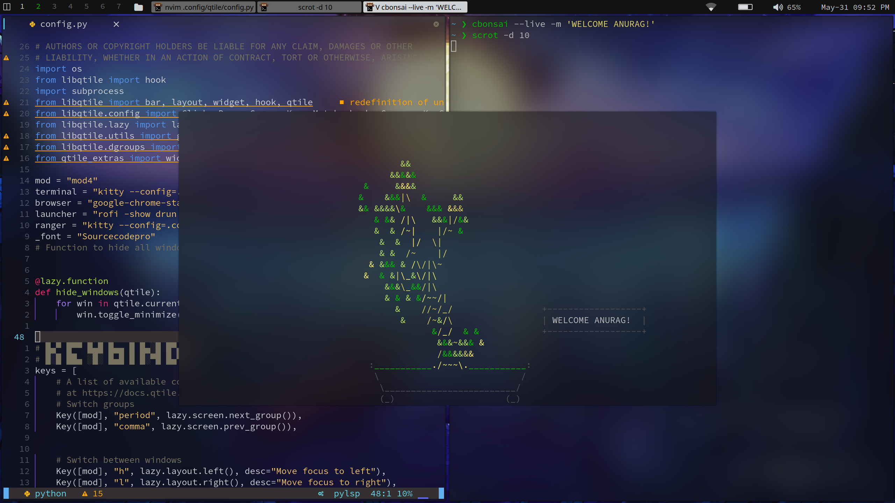
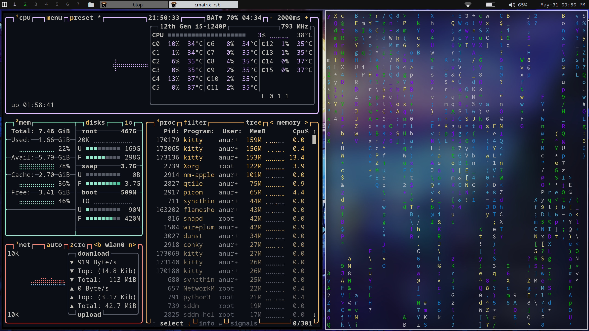

# dotfiles_linux
Includes my arch linux config files.
Following packages and programs are used:
* Qtile (Tiling window manager)
* Ranger (terminal file manager)
* Astrovim (neo-vim editor)
* Rofi (application launcher)
* Picom (Compositor)
* Kitty (terminal)
etc...
## Screenshots
 



### How to install
1. Clone the repository into your system.
```
$ git clone git@github.com:AnuragSaikia616/dotfiles_linux.git
```
2. Change directory to dotfiles_linux.
```
$ cd dotfiles_linux
```
3. Copy the files into your .config folder. The qtile folder includes integrated picom, conky and kitty config files. 
(WARNING: BE SURE TO CREATE A BACKUP OF THE FOLDERS)
```
$ cp -r qtile ~/.config/qtile
$ cp -r ranger ~/.config/ranger
```
#### EXTRA
I have also included some cool wallpapers in the wallpapers folder.
ENJOY!!!

